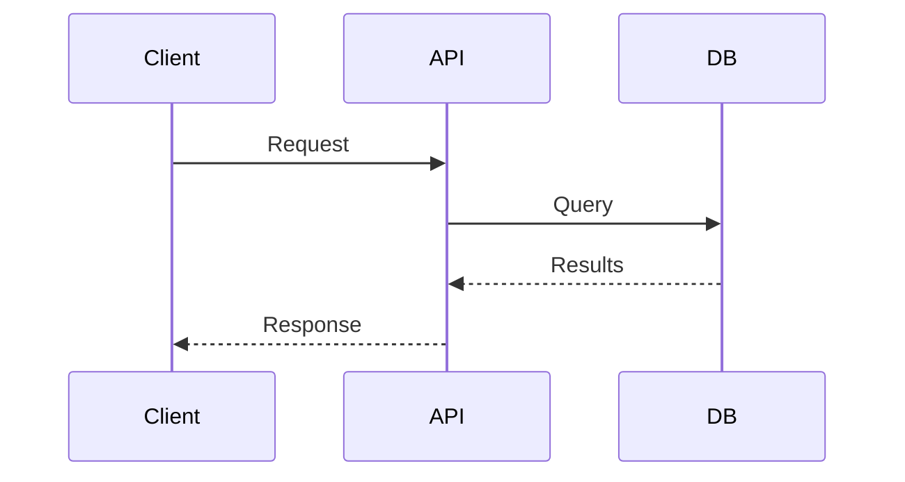

# claIDE

A desktop app for working with Claude Code. Instead of a traditional code editor with a small terminal tucked at the bottom, claIDE puts the terminal front and center — because that's where Claude Code lives.

## What is claIDE?

claIDE gives you a workspace to run one or more Claude Code sessions, organized by project. You can see what Claude is doing in real time, manage your configuration files, browse your project's files, and keep track of costs — all without leaving the app.

You don't need to be a programmer to use claIDE. If you can type instructions for Claude, you can use this app.

## Installing

Download the latest installer for your platform from the [Releases](https://github.com/johnjake3365/claide-releases/releases) page:

- **Windows** — `.exe` installer
- **macOS** — `.dmg` disk image
- **Linux** — `.AppImage` or `.deb` package

Run the installer and open claIDE. That's it — no additional setup required.

## First Launch

When claIDE starts for the first time, it automatically configures itself to work with Claude Code. You'll need Claude Code already installed on your system (see [Claude Code docs](https://docs.anthropic.com/en/docs/claude-code)).

To get started:

1. Open claIDE
2. Go to **File → Add Project** (or press `Ctrl+Shift+O`)
3. Choose a folder on your computer — this is the project Claude will work in
4. A terminal opens automatically. Type `claude` to start a Claude Code session

## The Interface

claIDE's interface has four main areas:

```
┌──────────────┬──────────────┬──────────────┬─────────────────┐
│ Left Sidebar │              │  File Viewer │  Right Sidebar  │
│              │   Terminal   │  (optional)  │                 │
│ Projects &   │              │              │  File Browser   │
│ Terminals    │              │              │  & Search       │
├──────────────┴──────────────┴──────────────┴─────────────────┤
│ Status Bar                                                   │
└──────────────────────────────────────────────────────────────┘
```

### The Terminal (center)

This is the main area where you interact with Claude Code. It works just like any other terminal — you type commands and see output. One terminal is visible at a time; click a different terminal in the left sidebar to switch.

### Left Sidebar — Projects & Terminals

Shows your open projects and the terminals under each one. Click a project name to expand or collapse its terminal list.

**What you can do here:**

- **Add a project** — File → Add Project, or `Ctrl+Shift+O`
- **Create a new terminal** — Right-click a project → New Terminal, or `Ctrl+Shift+T`
- **Switch terminals** — Click any terminal name
- **Rename a terminal** — Double-click its name, or right-click → Rename
- **Reorder projects** — Drag and drop projects to rearrange them
- **Close a terminal** — Right-click → Close Terminal
- **Close a project** — Right-click → Close Project (you'll be warned if terminals are still open)

### Right Sidebar — File Browser

Shows the files and folders in your active project. Click any file to preview it.

**Pinned files** appear at the top — these are special files that Claude Code uses (like `CLAUDE.md`, `.mcp.json`, settings files). Only files that actually exist in your project are shown.

The **search box** at the top filters the file tree by name.

**Right-click menu** on files and folders:

| Action | Description |
|--------|-------------|
| **Open with OS** | Open the file in its default application (files only) |
| **Reveal in Explorer** | Show the file in Finder/Explorer (files only) |
| **Open in Explorer** | Open the folder in Finder/Explorer (directories only) |
| **Copy Filename** | Copy the path relative to the project root to the clipboard |
| **New File** | Create a new file — an inline input appears in the directory |
| **New Folder** | Create a new folder — an inline input appears in the directory |
| **Pin / Unpin** | Pin or unpin the item in the sidebar |

Right-clicking **blank space** below the file tree shows New File, New Folder, and Open in Explorer (targeting the project root).

**Drag and drop:**
- **Drag files in** from Finder/Explorer into the sidebar to copy them into your project. Hover over a specific folder to target it.
- **Drag files out** from the sidebar to Finder/Explorer or your desktop to copy them.

### File Viewer (center-right, optional)

When you click a file in the right sidebar, it opens in a split view next to the terminal:

- **Markdown files** are shown rendered (formatted), with a toggle to see the raw source. YAML frontmatter is displayed as a styled key-value table above the content. Checkboxes (`- [ ]` / `- [x]`) are interactive — click to toggle and save to disk
- **Code and text files** are shown with syntax highlighting
- **Images** (PNG, JPG, GIF, WebP, BMP, ICO) are shown centered with dimensions displayed below
- **SVG files** are rendered visually, with a toggle to see the XML source
- **CSV and TSV files** are shown as formatted tables with sticky headers, row numbers, and zebra striping — with a toggle to see the raw text
- **Excel files** (`.xlsx`, `.xls`) are shown as formatted tables with sheet tabs for multi-sheet workbooks
- **Word documents** (`.docx`) are rendered as formatted text in a sandboxed preview
- **Mermaid diagrams** (`.mmd`, `.mermaid`) are rendered as interactive diagrams with a Rendered/Source toggle — see [Mermaid Diagrams](#mermaid-diagrams) below
- **Mermaid in Markdown** — ` ```mermaid ` fenced code blocks in `.md` files render as diagrams inline, and are preserved when exporting to PDF or copying as rich text
- **JSON files** have a Tree/Source toggle — tree view shows a collapsible, color-coded explorer; source view shows syntax-highlighted code
- **HTML files** are rendered in a sandboxed preview, with a toggle to see the source
- **Edit button** lets you modify text-based files and save changes
- **Unsaved changes guard** — switching from edit mode to rendered view or closing the preview prompts to Save, Discard, or Cancel when you have unsaved edits
- **Refresh button** — reloads the file from disk. A **"New Version"** badge appears automatically when the file changes externally (e.g. Claude edits it)
- **Right-click** in the viewer for Copy, Paste (edit mode), and Select All

Close the file viewer by clicking the X, or by clicking the same file again.

**Focus Lock** (padlock icon in the viewer header) keeps the current file pinned even when you switch terminals. Useful for keeping notes or instructions visible while working across terminals.

### Status Bar (bottom)

Shows live information about the active terminal's Claude Code session:

| Item | What it shows |
|------|---------------|
| **Active tool** | The tool Claude is currently using (Bash, Read, Edit, etc.) — appears only while Claude is working |
| **Context remaining** | How much conversation context remains (green = plenty, yellow = getting low, red = nearly full) |
| **Turns** | Number of back-and-forth exchanges in the current session |
| **Cost** | Running cost of the session in USD |
| **Model** | Which Claude model is being used (e.g., Sonnet 4.6, Opus 4.6) |

## Memorized Commands

Save frequently-used commands so you can paste them with a couple of keystrokes. This is useful for commands you run often, like starting a dev server, running tests, or giving Claude a specific instruction.

### Saving a command

1. Select text in the terminal (click and drag, or double-click a word)
2. Right-click → **Memorize Command**
3. Give it a name (e.g., "Run tests") and optionally edit the command text
4. Click Save

### Using a saved command

**From the right-click menu:** Right-click anywhere in the terminal. Your saved commands appear at the bottom of the menu. Click one to paste it into the terminal (it won't run automatically — you press Enter when ready).

**Using the `>` shortcut:** Type `>` at the start of a line (or after a space). A search palette appears with your saved commands. Start typing to filter by name. Press Enter or Tab to paste the selected command. Press Escape to cancel.

The `>` shortcut only activates when:
- `>` is the first character on the line, or
- `>` comes after a space or tab

Typing `->`, `<>`, or `>` in the middle of a word won't trigger it.

### Managing commands

Right-click a project in the left sidebar → **Memorized Commands**. This opens a management panel where you can:

- **Add** new commands
- **Edit** existing command names or text
- **Delete** commands (with confirmation)
- **Paste Now** — immediately paste a command into the active terminal

Commands are saved per project and persist across app restarts.

## Claude Config Panel

Access via **View → Claude Config** (`Ctrl+Shift+.`). This panel appears at the bottom of the left sidebar and gives you quick access to Claude Code's global configuration files:

- `CLAUDE.md` — Instructions that Claude reads at the start of every conversation
- `CLAUDE.local.md` — Personal instructions (not shared with your team)
- `settings.json` / `settings.local.json` — Claude Code settings
- `rules/` — Modular instruction files
- `skills/` — Custom slash commands
- `agents/` — Custom sub-agents

Click any item to view or edit it. Items shown dimmed don't exist yet — clicking them creates a new file.

## MCP Config Panel

Access via **View → MCP Config** (`Ctrl+Shift+M`). MCP (Model Context Protocol) servers give Claude access to external tools and data sources. This panel appears at the bottom of the right sidebar.

**Two scopes:**
- **Project** — stored in `.mcp.json` in your project folder (shared with your team)
- **User** — stored in your global Claude settings (available in all projects)

**What you can do:**

- **Add a server** — Click the `+` button. Choose from templates (GitHub, Slack, Postgres, etc.) or start blank
- **Edit a server** — Click its name to open the editor
- **Health check** — HTTP/SSE servers show a green or red dot indicating if they're reachable
- **Enable/Disable** — Right-click → Enable/Disable (disabled servers are greyed out)
- **Move between scopes** — Right-click → Move to User/Project
- **Copy as JSON** — Right-click → Copy as JSON
- **Delete** — Right-click → Delete

## Terminal Capture

Capture selected terminal text and save it to a file for later reference. Useful for saving Claude's output, error messages, or interesting code snippets.

### Capturing text

1. Select text in the terminal (click and drag)
2. Right-click → **New Capture** to save to a new file, or **Append Capture** to add to the most recent capture file
3. The capture opens automatically in the file viewer

You can also use keyboard shortcuts:
- **Alt+C** — New Capture
- **Alt+Shift+C** — Append Capture

Both shortcuts can be customized in Settings → Behavior → Terminal Capture.

### Capture formats

Choose your preferred format in Settings → Behavior → Terminal Capture:

| Format | Description |
|--------|-------------|
| **Markdown** | Plain text in code blocks — simple, lightweight |
| **Markdown with HTML** (default) | Terminal colors and formatting preserved as HTML inside markdown |
| **HTML** | Full standalone HTML document with all terminal styling |

Markdown formats produce `.md` files. HTML format produces `.html` files.

### Managing captures

When viewing a capture file:
- **Rename** — edit the filename in the bar below the header
- **Delete** — click the Delete button (with confirmation)

Capture files are stored in a `.capture/` folder inside your project directory. Each entry is separated by a horizontal rule.

## Database Connections

Connect to **SQL Server**, **PostgreSQL**, **MySQL**, and **SQLite** databases from claIDE — browse schemas, run queries, and give Claude Code direct DB access via a local MCP server.

Open **Utilities → Database Connections** to manage connections. Select your database engine when creating a new connection — the form adapts to show engine-specific fields (SSL mode for PostgreSQL, encrypt/trust cert for SQL Server, file path for SQLite, etc.). Start and stop the MCP server directly from the connection editor or via right-click context menu.

Each engine gets its own MCP server with up to 26 tools (fewer for SQLite which lacks stored procedures). Tool names and input schemas are identical across engines, so Claude interacts with all databases the same way.

**See:** Help → Database Connections for the full user guide, or [docs/database-connections.md](docs/database-connections.md)

## Mermaid Diagrams

claIDE renders [Mermaid](https://mermaid.js.org/) diagrams natively — flowcharts, sequence diagrams, ER diagrams, state machines, Gantt charts, and more. Diagrams are plain text, so Claude Code can create, read, and edit them directly.

### Standalone diagram files

Create a `.mmd` or `.mermaid` file in your project:

```
graph TD
    A[Browser] -->|HTTPS| B[Load Balancer]
    B --> C[API Server 1]
    B --> D[API Server 2]
    C --> E[(PostgreSQL)]
    D --> E
```

Click it in the file tree to see the rendered diagram. Use the **Rendered/Source** toggle to switch between the visual diagram and the text source. Edit via Source → Edit → Save.

### Diagrams in Markdown

Use a fenced code block with the `mermaid` language tag in any `.md` file:

````markdown
# Architecture


````

The diagram renders inline in the Rendered view. Diagrams are preserved when exporting markdown to PDF or copying as rich text.

### Supported diagram types

Flowchart, Sequence, Class, State, ER, Gantt, Pie, Git Graph, Mindmap, Timeline, Quadrant, Block, Sankey, and more — anything Mermaid supports.

### Working with Claude

Since diagrams are plain text, you can ask Claude to create or modify them:

> "Create a Mermaid ER diagram for the users, orders, and products tables"

> "Add a cache layer to architecture.mmd between the API and database"

## Session Replay

Review what happened in a terminal session by replaying its output:

1. Right-click a terminal in the left sidebar → **Session Replay**
2. The replay opens in the file viewer, showing the terminal output exactly as it appeared (including colors and formatting)
3. Use the horizontal scrollbar for wide output — no line wrapping is added
4. Adjust the number of lines shown with the "lines" field at the top

Session Replay requires terminal logging to be enabled (it is by default). See Settings for details.

## Settings

Open via **File → Settings** (`Ctrl+,`).

### Appearance
- **Theme** — Choose from Dark, Light, Win95, Eclipse, Hot Dog, or Sequoia
- **Font size** — Terminal font size
- **Font family** — Terminal font (monospace fonts recommended)

### Behavior
- **Shell path** — Custom shell path (leave empty for system default)
- **Copy on select** — Automatically copy text when you select it in the terminal
- **Scrollback** — Number of lines the terminal remembers (default: 5000)
- **Key bindings** — Customize shortcuts for newline continuation, copy, and paste
- **Terminal Capture** — Key bindings for New Capture and Append Capture, plus capture format selection (Markdown, Markdown with HTML, or HTML)
- **Sessions** — Auto-resume sessions: automatically resume the last Claude session when switching to an idle terminal
- **Preview Pane** — Source opens editor: clicking Source in the preview pane enters edit mode directly
- **Updates** — Check for updates on startup (enabled by default)

### Terminal Logging
- **Enable logging** — Save terminal output to files (on by default)
- **Log formats** — Raw (with colors, for replay) and/or plain text
- **Log directory** — Where logs are saved (default: `~/.claide/term_logs`)
- **Per-project folders** — Organize logs by project name

## Keyboard Shortcuts

| Action | Shortcut |
|--------|----------|
| Add Project | `Ctrl+Shift+O` |
| New Terminal | `Ctrl+Shift+T` |
| Settings | `Ctrl+,` |
| Toggle Left Sidebar | `Ctrl+B` |
| Claude Config | `Ctrl+Shift+.` |
| MCP Config | `Ctrl+Shift+M` |
| Copy (in terminal) | `Ctrl+Shift+C` |
| Paste (in terminal) | `Ctrl+Shift+V` |
| Newline (line continuation) | `Ctrl+Enter` |
| New Capture | `Alt+C` |
| Append Capture | `Alt+Shift+C` |
| Zoom In / Out / Reset | `Ctrl+=` / `Ctrl+-` / `Ctrl+0` |

Copy, paste, and newline shortcuts can be customized in Settings → Behavior.

## Tips

- **Multiple Claude sessions** — You can run Claude Code in several terminals at once, even in the same project. Each session is independent.
- **Quick file access** — The pinned files section at the top of the right sidebar gives you one-click access to `CLAUDE.md` and other important config files.
- **Keep instructions visible** — Open `CLAUDE.md` in the file viewer, then click the lock icon. It stays visible even when you switch terminals.
- **Command palette for repetitive tasks** — If you find yourself typing the same instructions to Claude, memorize them and use the `>` shortcut.
- **Watch the status bar** — The "context left" indicator tells you when Claude is running low on memory. When it turns red, Claude will auto-compact the conversation soon.
- **Review costs** — The status bar shows per-session cost. Use this to stay aware of API usage.

## Updates

claIDE checks for updates automatically when the app starts. If a new version is available, a dialog appears with options to:

- **Download** — opens the release page in your browser
- **View Changes** — opens the changelog for the new version
- **Skip This Version** — suppresses the notification for this specific version (manual checks still show it)
- **Later** — dismisses without any lasting effect

You can also check manually via **Help → Check for Updates** at any time.

To disable automatic checks, go to **Settings → Behavior** and uncheck "Check for updates on startup."

**What's New** — on first launch after an update, a popup shows highlights of what changed. You can also open it anytime via **Help → What's New**.

To report bugs or request features, use **Help → Report an Issue**.

## Requirements

- [Claude Code](https://docs.anthropic.com/en/docs/claude-code) must be installed and working on your system
- Windows 10+, macOS 12+, or a modern Linux distribution

## Troubleshooting

**Claude Code doesn't start in the terminal**
Make sure `claude` works in a regular terminal outside of claIDE. If it does, try closing and reopening the terminal in claIDE.

**Status bar shows no data**
The status bar only shows information during an active Claude Code session. Start a session by typing `claude` in a terminal.

**Projects don't persist after restart**
Check that claIDE has write access to its data directory. On Windows this is `%APPDATA%/claide/`, on macOS `~/Library/Application Support/claide/`, on Linux `~/.config/claide/`.

**Terminal feels slow or unresponsive**
Try reducing the scrollback buffer in Settings → Behavior (default is 5000 lines).

